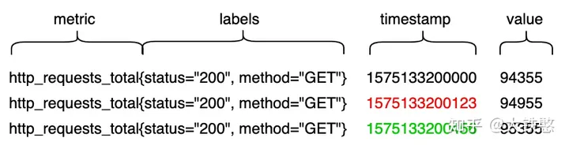
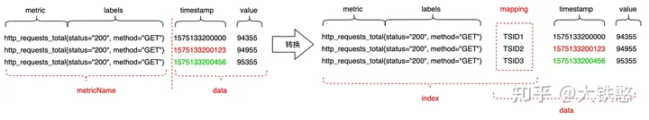
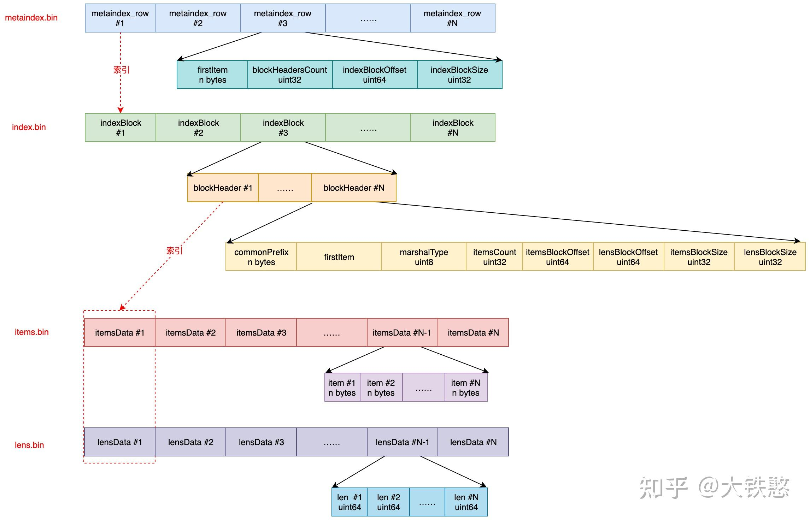

搭建

- 启动node_exporter
# vmstorage
main.go直接启动，数据目录在本工程目录下

## 文件存储格式

参考：[浅析下开源时序数据库VictoriaMetrics的存储机制 - 知乎 (zhihu.com)](https://zhuanlan.zhihu.com/p/368912946)

VictoriaMetrics支持的Prometheus协议的一个写入示例。



根据包含metric和labels的MetricName生成一个唯一标识TSID，然后metric + labels + TSID作为索引index， TSID + timestamp + value作为数据data，最后索引index和数据data分别进行存储和检索。



VictoriaMetrics的数据整体上分成索引和数据两个部分。其中，索引部分主要是用于支持按照label或者tag进行多维检索。与大多数时序数据库的数据组织方式一样，比如InfluxDB、Prometheus、OpenTSDB等，VictoriaMetrics也是按时间线来组织数据的，即数据存储时，先将数据按TSID进行分组，然后每个TSID的包含的数据点各自使用列式压缩存储。

### 索引

#### 索引目录

indexdb目录下由多个table目录，每个table目录代表一个完整的自治的索引，每个table目录下，通过parts.json记录多个不同的part目录，part命名方式比较简单，根据系统纳秒时间戳自增生成的mergeIdx的16进制表示。

indexdb下面的形如"17BE1E7E3DFDE0A5"是怎么生成的，或者什么时候切换新的目录写索引的呢？VictoriaMetrics会根据用户设置的数据保留周期retention来定期滚动索引目录，当前一个索引目录的保留时间到了，就会切换一个新的目录，重新生成索引。


#### 索引文件

VictoriaMetrics每次内存Flush或者后台Merge时生成的索引part，主要包含metaindex.bin、index.bin、lens.bin、items.bin、metadata.json 这5个文件。文件的关系如下图所示, metaindex.bin文件通过metaindex_row索引index.bin文件，index.bin文件通过indexBlock中的blockHeader同时索引lens.bin文件和items.bin文件。



##### metadata.json 

```json
{"ItemsCount":6941,"BlocksCount":10,"FirstItem":"01000000010000000001676f5f67635f6475726174696f6e5f7365636f6e64730117bf0cb660e945aa","LastItem":"070000000000004d5c00000001000000007570016a6f62016e6f64655f6578706f7274657201696e7374616e6365013132372e302e302e313a39313030016d6f6e69746f72016c6f63616c746573740102000000010000000023af5a217b078e8f10674d0101e4d38517bf0cb660e94882"}
```

有文件包含的item数itemsCount和block数blocksCount

##### metaindex.bin


### 数据

#### 数据目录

#### 数据文件


# vminsert

## start
启动参数
```shell
-storageNode=:8400
```
## 源码

2个字节长的为0指的是__name__
# vmagent
启动参数
```shell
-promscrape.config=/home/gengap/tmp/prometheus.yml
-remoteWrite.url="http://127.0.0.1:8480/insert/1/prometheus/api/v1/write"
-promscrape.config.strictParse=false
-promscrape.configCheckInterval=1m
```
# vmselect
启动参数
```shell
-storageNode=:8401
```
# 查询
http://127.0.0.1:8481/select/1/prometheus/api/v1/query?query=up  
返回结果
```json
{"status":"success","isPartial":false,"data":{"resultType":"vector","result":[{"metric":{"__name__":"up","instance":"127.0.0.1:9100","job":"node_exporter","monitor":"localtest"},"value":[1711101466,"1"]}]},"stats":{"seriesFetched": "1","executionTimeMsec":1}}```
```