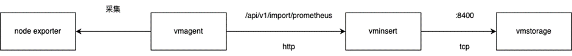
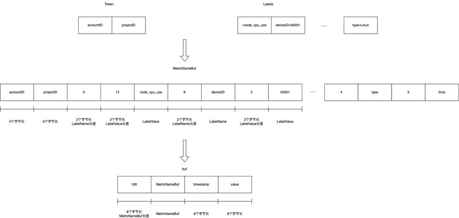

搭建

- 启动node_exporter
# vmstorage
main.go直接启动，数据目录在本工程目录下
# vminsert
## start
启动参数
```shell
-storageNode=:8400
```
## 源码

2个字节长的为0指的是__name__
# vmagent
启动参数
```shell
-promscrape.config=/home/gengap/tmp/prometheus.yml
-remoteWrite.url="http://127.0.0.1:8480/insert/1/prometheus/api/v1/write"
-promscrape.config.strictParse=false
-promscrape.configCheckInterval=1m
```
# vmselect
启动参数
```shell
-storageNode=:8401
```
# 查询
http://127.0.0.1:8481/select/1/prometheus/api/v1/query?query=up  
返回结果
```json
{"status":"success","isPartial":false,"data":{"resultType":"vector","result":[{"metric":{"__name__":"up","instance":"127.0.0.1:9100","job":"node_exporter","monitor":"localtest"},"value":[1711101466,"1"]}]},"stats":{"seriesFetched": "1","executionTimeMsec":1}}```
```