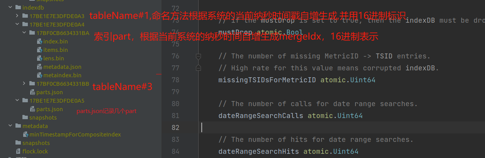

搭建


- 启动node_exporter
# vmstorage
main.go直接启动，数据目录在本工程目录下

## 文件存储格式

参考：[浅析下开源时序数据库VictoriaMetrics的存储机制 - 知乎 (zhihu.com)](https://zhuanlan.zhihu.com/p/368912946)

VictoriaMetrics支持的Prometheus协议的一个写入示例。


根据包含metric和labels的MetricName生成一个唯一标识TSID，然后metric + labels + TSID作为索引index， TSID + timestamp + value作为数据data，最后索引index和数据data分别进行存储和检索。


metricGroup:  即http_requests_total

VictoriaMetrics的数据整体上分成索引和数据两个部分。其中，索引部分主要是用于支持按照label或者tag进行多维检索。与大多数时序数据库的数据组织方式一样，比如InfluxDB、Prometheus、OpenTSDB等，VictoriaMetrics也是按时间线来组织数据的，即数据存储时，先将数据按TSID进行分组，然后每个TSID的包含的数据点各自使用列式压缩存储。

### 索引

#### 索引目录

indexdb目录下由多个table目录，每个table目录代表一个完整的自治的索引。每个table目录下，通过parts.json记录多个不同的part目录，part命名方式比较简单，根据系统纳秒时间戳自增生成的mergeIdx的16进制表示。

17BF0CB6634331BB的part.json的内容

```json
["17BF0CB6634331BA","17BF0CB6634331BB"]
```

indexdb下面的形如"17BE1E7E3DFDE0A5"是怎么生成的，或者什么时候切换新的目录写索引的呢？VictoriaMetrics会根据用户设置的数据保留周期retention来定期滚动索引目录，当前一个索引目录的保留时间到了，就会切换一个新的目录，重新生成索引。



#### 索引文件

VictoriaMetrics每次内存Flush或者后台Merge时生成的索引part，主要包含metaindex.bin、index.bin、lens.bin、items.bin、metadata.json 这5个文件。文件的关系如下图所示, metaindex.bin文件通过metaindex_row索引index.bin文件，index.bin文件通过indexBlock中的blockHeader同时索引lens.bin文件和items.bin文件。


VictoriaMetrics索引文件都是围绕着item来组织的，那么item的结构是什么样子的？或者item的种类有哪些？ 在VictoriaMetrics中item的整体上是一个KeyValue结构的字节数组，共计有7种类型，每种类型的item通过固定前缀来区分，前缀类型如下代码所示。

```go
	// Prefix for Tag->MetricID entries.
	nsPrefixTagToMetricIDs = 1
	// Prefix for MetricID->TSID entries.
	nsPrefixMetricIDToTSID = 2
	// Prefix for MetricID->MetricName entries.
	nsPrefixMetricIDToMetricName = 3
	// Prefix for deleted MetricID entries.
	nsPrefixDeletedMetricID = 4
	// Prefix for Date->MetricID entries.
	nsPrefixDateToMetricID = 5
	// Prefix for (Date,Tag)->MetricID entries.
	nsPrefixDateTagToMetricIDs = 6
	// Prefix for (Date,MetricName)->TSID entries.
	nsPrefixDateMetricNameToTSID = 7
```

下面描述MetricID -> MetricName的item，prefix为3。

每种item结构都不太一样，只是要注意每种索引的前缀是不一样的。根据代码中描述可以找到具体的每种类型的item构成。


对应的代码：

```go
func (is *indexSearch) createGlobalIndexes(tsid *TSID, mn *MetricName) {
	// The order of index items is important.
	// It guarantees index consistency.

	ii := getIndexItems()
	defer putIndexItems(ii)

	// Create MetricID -> MetricName index.
	ii.B = marshalCommonPrefix(ii.B, nsPrefixMetricIDToMetricName, mn.AccountID, mn.ProjectID)
	ii.B = encoding.MarshalUint64(ii.B, tsid.MetricID)
	ii.B = mn.Marshal(ii.B)
	ii.Next()

	// Create MetricID -> TSID index.
	ii.B = marshalCommonPrefix(ii.B, nsPrefixMetricIDToTSID, mn.AccountID, mn.ProjectID)
	ii.B = encoding.MarshalUint64(ii.B, tsid.MetricID)
	ii.B = tsid.Marshal(ii.B)
	ii.Next()

	prefix := kbPool.Get()
	prefix.B = marshalCommonPrefix(prefix.B[:0], nsPrefixTagToMetricIDs, mn.AccountID, mn.ProjectID)
	ii.registerTagIndexes(prefix.B, mn, tsid.MetricID)
	kbPool.Put(prefix)

	is.db.tb.AddItems(ii.Items)
}

func (mn *MetricName) Marshal(dst []byte) []byte {
	// Calculate the required size and pre-allocate space in dst
	dstLen := len(dst)
	requiredSize := 8 + len(mn.MetricGroup) + 1
	for i := range mn.Tags {
		tag := &mn.Tags[i]
		requiredSize += len(tag.Key) + len(tag.Value) + 2
	}
	dst = bytesutil.ResizeWithCopyMayOverallocate(dst, requiredSize)[:dstLen]

	dst = encoding.MarshalUint32(dst, mn.AccountID)
	dst = encoding.MarshalUint32(dst, mn.ProjectID)
	dst = marshalTagValue(dst, mn.MetricGroup)

	// Marshal tags.
	tags := mn.Tags
	for i := range tags {
		t := &tags[i]
		dst = t.Marshal(dst)
	}
	return dst
}
```


上面谈到metricGroup、metricName、Tag、meitricID、TSID、Date

metricGroup包含名称相同的metric，如` memory_usage `， 但具有不同的标签。例如，以下监控metric属于监控metricGroup 'memory_usage':
  memory_usage{datacenter="foo1", job="bar1", instance="baz1:1234"}
  memory_usage{datacenter="foo1", job="bar1", instance="baz2:1234"}
  memory_usage{datacenter="foo1", job="bar2", instance="baz1:1234"}
  memory_usage{datacenter="foo2", job="bar1", instance="baz2:1234"}

以上序列数据：

​	metricGroup： memory_usage

​    meitricName：  memory_usage{datacenter="foo1", job="bar1", instance="baz2:1234"}

​    Tag：datacenter="foo1", job="bar1", instance="baz2:1234"

​    Date： 指标数据的时间戳

- metricGroupID根据MetricName中的MetricGroup使用xxhash的sum64算法生成。
- JobID和InstanceID分别由MetricName中的tag的第一个tag和第二个tag使用xxhash的sum64算法生成。为什么使用第一个tag和第二个tag？这是因为VictoriaMetrics在写入时，将写入请求中的JobID和InstanceID放在了Tag数组的第一个和第二个位置
- MetricID，使用VictoriaMetrics进程启动时的系统纳秒时间戳自增生成。

```go
// MetricName reperesents a metric name.
type MetricName struct {
	AccountID uint32
	ProjectID uint32

	MetricGroup []byte

	// Tags are optional. They must be sorted by tag Key for canonical view.
	// Use sortTags method.
	Tags []Tag
}
// Tag represents a (key, value) tag for metric.
type Tag struct {
	Key   []byte
	Value []byte
}
```

```go
// TSID is unique id for a time series.
//
// Time series blocks are sorted by TSID.
//
// All the fields except MetricID are optional. They exist solely for better
// grouping of related metrics.
// It is OK if their meaning differ from their naming.
type TSID struct {
	// AccountID is the id of the registered account.
	AccountID uint32

	// ProjectID is the id of the project.
	//
	// The ProjectID must be unique for the given AccountID.
	ProjectID uint32

	// MetricGroupID is the id of metric group inside the given project.
	//
	// MetricGroupID must be unique for the given (AccountID, ProjectID).
	//
	// Metric group contains metrics with the identical name like
	// 'memory_usage', 'http_requests', but with different
	// labels. For instance, the following metrics belong
	// to a metric group 'memory_usage':
	//
	//   memory_usage{datacenter="foo1", job="bar1", instance="baz1:1234"}
	//   memory_usage{datacenter="foo1", job="bar1", instance="baz2:1234"}
	//   memory_usage{datacenter="foo1", job="bar2", instance="baz1:1234"}
	//   memory_usage{datacenter="foo2", job="bar1", instance="baz2:1234"}
	MetricGroupID uint64

	// JobID is the id of an individual job (aka service)
	// for the given project.
	//
	// JobID must be unique for the given (AccountID, ProjectID).
	//
	// Service may consist of multiple instances.
	// See https://prometheus.io/docs/concepts/jobs_instances/ for details.
	JobID uint32

	// InstanceID is the id of an instance (aka process)
	// for the given project.
	//
	// InstanceID must be unique for the given (AccountID, ProjectID).
	//
	// See https://prometheus.io/docs/concepts/jobs_instances/ for details.
	InstanceID uint32

	// MetricID is the unique id of the metric (time series).
	//
	// All the other TSID fields may be obtained by MetricID.
	MetricID uint64
}

```

因为TSID中除了MetricID外，其他字段都是可选的，因此TSID中可以始终作为有效信息的只有metricID，因此VictoriaMetrics的在构建tag到TSID的字典过程中，是直接存储的tag到metricID的字典。

以写入http_requests_total{status="200", method="GET"}为例，则MetricName为http_requests_total{status="200", method="GET"}， 假设生成的TSID为{metricGroupID=0, jobID=0, instanceID=0, metricID=51106185174286}，则VictoriaMetrics在写入时就构建了如下几种类型的索引item，其他类型的索引item是在后台或者查询时构建的。

- metricName -> TSID, 即http_requests_total{status="200", method="GET"} -> {metricGroupID=0, jobID=0, instanceID=0, metricID=51106185174286}
- metricID -> metricName，即51106185174286 -> http_requests_total{status="200", method="GET"}
-  metricID -> TSID，即51106185174286 -> {metricGroupID=0, jobID=0, instanceID=0, metricID=51106185174286}
- tag -> metricID，即 status="200" -> 51106185174286, method="GET" -> 51106185174286, "" = http_requests_total -> 51106185174286（其实还有一个联合索引）

有了这些索引的item后，就可以支持基于tag的多维检索了，在当给定查询条件http_requests_total{status="200"}时，VictoriaMetrics先根据给定的tag条件，找出每个tag的metricID列表，然后求所有tag的metricID列表的交集，然后根据交集中的metricID，再到索引文件中检索出TSID，根据TSID就可以到数据文件中查询数据了，在返回结果之前，再根据TSID中的metricID，到索引文件中检索出对应的写入时的原始MetircName。

但是由于VictoriaMetrics的tag到metricID的字典，没有将相同tag的所有metricID放在一起存储，在检索时，一个tag可能需要查询多次才能得到完整的metricID列表。另外查询出metricID后，还要再到索引文件中去检索TSID才能去数据文件查询数据，又增加了一次IO开销。这样来看的话，VictoriaMetrics的索引文件在检索时，如果命中的时间线比较多的情况下，其IO开销会比较大，查询延迟也会比较高。

参照： [VictorialMetrics存储原理之索引 (qq.com)](https://mp.weixin.qq.com/s?__biz=MzU4MjQ0MTU4Ng==&mid=2247499460&idx=1&sn=946ff5168a0f159d2de05a7d26fda93b&chksm=fdbaf1d9cacd78cf1851d35743235117e70ccdd967579662435b717315786dbea8c31de180bd&scene=21#wechat_redirect)

##### metadata.json 

```json
{"ItemsCount":6941,"BlocksCount":10,"FirstItem":"01000000010000000001676f5f67635f6475726174696f6e5f7365636f6e64730117bf0cb660e945aa","LastItem":"070000000000004d5c00000001000000007570016a6f62016e6f64655f6578706f7274657201696e7374616e6365013132372e302e302e313a39313030016d6f6e69746f72016c6f63616c746573740102000000010000000023af5a217b078e8f10674d0101e4d38517bf0cb660e94882"}
```

有文件包含的item数itemsCount和block数blocksCount

##### metaindex.bin

包含一系列的metaindex_row， 每个metaindex_row中包含最小项firstItem、索引块包含的块头部数blockHeadersCount、索引块偏移indexBlockOffset、索引块大小indexBlockSize。

- metaindex_row在文件中的位置按照firstItem的大小的字典序排序存储，以支持二分检索；
- metaindex.bin文件使用ZSTD进行压缩；
- metaindex.bin文件中的内容在part打开时，会全部读出加载至内存中，以加速查询过滤；
- metaindex_row包含的firstItem为其索引的IndexBlock中所有blockHeader中的字典序最小的firstItem；
- 查找时根据firstItem进行二分检索；

##### index.bin

包含一系列的indexBlock, 每个indexBlock又包含一系列blockHeader，每个blockHeader的包含item的公共前缀commonPrefix、最小项firstItem、itemsData的序列化类型marshalType、itemsData包含的item数、item块的偏移itemsBlockOffset等内容。

- 每个indexBlock使用ZSTD压缩算法进行压缩；
- 在indexBlock中查找时，根据firstItem进行二分检索blockHeader；

##### items.bin

包含一系列的itemsData, 每个itemsData又包含一系列的item。

- itemsData会根据情况是否使用ZTSD压缩，当item个数小于2时，或者itemsData的长度小于64字节时，不压缩；当itemsData使用ZSTD压缩后的大小，大于原始itemsData的0.9倍时，则不压缩，否则使用ZSTD算法进行压缩。
- 每个item在存储时，去掉了blockHeader中的公共前缀commonPrefix以提高压缩率。

##### lens.bin

包含一系列的lensData, 每个lensData又包含一系列8字节的长度len， 长度len标识items.bin文件中对应item的长度。***在读取或者需要解析itemsData中的item时，先要读取对应的lensData中对应的长度len。*** 当itemsData进行压缩时，lensData会先使用异或算法进行压缩，然后再使用ZSTD算法进一步压缩。

### 数据

#### 数据目录


数据目录data的具体结构，在图中使用红色文字，对主要目录或文件做了简单说明，其中最主要的是big和small目录，这两个目录的结构是一样的。

在small目录下，以月为单位不断生成partition目录，比如上图中的2024_03目录，对应的实现逻辑在源码lib/storage/part.go中。

内存中的数据每刷盘一次就会生成一个part目录，如上图中的17BF0CB672318BB，17BF0CB672318BB是生成这个目录时的系统纳秒时间戳的16进制表示,对应的实现逻辑在源码lib/storage/part.go中；

看到这里，可能会有一些疑问？比如为何要分成big和small目录, 或者说big目录和small中的数据关系是什么？ 这个需要从VictoriaMetrics的compaction机制讲起。

在VictoriaMetrics中，small目录和big目录都会周期性检查，是否需要做part的合并。VictoriaMetrics默认每个10ms检查一次partition目录下的part是否需要做merge。如果检查出有满足merge条件的parts，则这些parts合并为一个part。如果没有满足条件的part进行merge，则以10ms为基进行指数休眠，最大休眠时间为10s。

VictoriaMetrics在写数据时，先写入在small目录下的相应partition目录下面的，small目录下的每个partition最多256个part。VictoriaMetrics在Compaction时，默认一次最多合并15个part，且small目录下的part最多包含1000W行数据，即1000W个数据点。因此，当一次待合并的parts中包含的行数超过1000W行时，其合并的输出路径为big目录下的同名partition目录下。

因此，big目录下的数据由small目录下的数据在后台compaction时合并生成的。 那么为什么要分成big目录和small目录呢？

这个主要是从磁盘空间占用上来考虑的。时序数据经常读取最近写入的数据，较少读历史数据。而且，时序数据的数据量比较大，通常会使用压缩算法进行压缩。

数据进行压缩后，读取时需要解压，采用不同级别的压缩压缩算法其解压速度不一样，通常压缩级别越高，其解压速度越慢。在VictoriaMetrics在时序压缩的基础上，又采用了ZSTD这个通用压缩算法进一步压缩了数据，以提高压缩率。在small目录中的part数据，采用的是低级别的ZSTD，而big目录下的数据，采用的是高级别的ZSTD。

因此，VictoriaMetrics分成small目录和big目录，主要是兼顾近期数据的读取和历史数据的压缩率。

#### 数据文件


VictoriaMetrics每次内存Flush或者后台Merge时生成的数据part，包含metaindex.bin、index.bin、timestamps.bin、values.bin、metadata.json 等5个文件。metaindex.bin文件索引index.bin文件，index.bin文件同时索引timestamps.bin和values.bin文件。

##### metadata.json

```json
{"RowsCount":21286,"BlocksCount":734,"MinTimestamp":1711100090094,"MaxTimestamp":1711101770094,"MinDedupInterval":0}
```

21286表示这个目录下包含的数据行数rowsCount, 734表示这个目录中包含的数据块数blocksCount, 1711100090094表示目录中包含的数据的最小时间戳，1711101770094表示目录中包含的数据的最大时间戳

##### metaindex.bin

文件中，包含一系列的metaindex_row， 每个metaindex_row中包含时间线标识TSID、最小时间戳minTimestamp、最大时间戳maxTimestamp、索引块偏移indexBlockOffset、索引块大小indexBlockSize、索引块包含的块头部数blockHeadersCount。

- metaindex_row在文件中的位置按照TSID的大小的字典序排序存储；
- metaindex.bin文件使用ZSTD进行压缩；
- metaindex.bin文件中的内容在part打开时，会全部读出加载至内存中，以加速查询过滤；
- metaindex_row包含时间线标识TSID为其索引的IndexBlock中所有blockHeader中的最小时间标识TSID；
- metaindex_row包含最小时间戳minTimestamp为其索引的IndexBlock中所有blockHeader中的最小时间戳minTimestamp；
- metaindex_row包含最大时间戳maxTimestamp为其索引的IndexBlock中所有blockHeader中的最大时间戳maxTimestamp；
- 查找时根据TSID进行二分检索；

##### index.bin

文件中，包含一系列的indexBlock, 每个indexBlock又包含一系列blockHeader，每个blockHeader的包含时间线标识TSID、最小时间戳minTimestamp、最大时间戳maxTimestamp、第一个指标值firstValue、时间戳数据块偏移timestampsBlockOffset、指标值数据块偏移valuesBlockOffset等内容。

- 每个indexBlock使用ZSTD压缩算法进行压缩；
- 查找时，线性遍历blockHeader查找TSID；

##### timestamps.bin和values.bin

文件中，包含一系列时间线的时间戳压缩块timestampsData; values.bin文件中，包含的一系列时间线的指标值压缩块valuesData。 其中，timestampsData和values.data会根据时序数据特征进行压缩，整体上的压缩思路是：先做时序压缩，然后在做通用压缩。比如，先做delta-of-delta计算或者异或计算，然后根据情况做zig-zag，最后再根据情况做一次ZSTD压缩，VictoriaMetrics支持的压缩算法或者类型主要有6种，如下图所示，压缩编码源码在lib/encoding/encoding.go文件中。

```go
const (
	// MarshalTypeZSTDNearestDelta2 is used for marshaling counter
	// timeseries.
	MarshalTypeZSTDNearestDelta2 = MarshalType(1)

	// MarshalTypeDeltaConst is used for marshaling constantly changed
	// time series with constant delta.
	MarshalTypeDeltaConst = MarshalType(2)

	// MarshalTypeConst is used for marshaling time series containing only
	// a single constant.
	MarshalTypeConst = MarshalType(3)

	// MarshalTypeZSTDNearestDelta is used for marshaling gauge timeseries.
	MarshalTypeZSTDNearestDelta = MarshalType(4)

	// MarshalTypeNearestDelta2 is used instead of MarshalTypeZSTDNearestDelta2
	// if compression doesn't help.
	MarshalTypeNearestDelta2 = MarshalType(5)

	// MarshalTypeNearestDelta is used instead of MarshalTypeZSTDNearestDelta
	// if compression doesn't help.
	MarshalTypeNearestDelta = MarshalType(6)
)
```

[VictoriaMetrics文档](https://link.zhihu.com/?target=https%3A//github.com/VictoriaMetrics/VictoriaMetrics/blob/master/docs/SampleSizeCalculations.md)中提及在生产环境中，每个数据点（8字节时间戳 + 8字节value共计16字节）压缩后小于1个字节，最高可达 0.4字节。

### 索引部分源码

#### 重要的struct

列出几个重要的struct， 并分别对应几个数据目录。

```go
// indexDB represents an index db
type indexDB struct {
	// The number of references to indexDB struct.
	// 原子计数器必须位于结构体的顶部，以便在32位架构上正确对齐8个字节
	refCount atomic.Int32

	// if the mustDrop is set to true, then the indexDB must be dropped after refCount reaches zero.
	mustDrop atomic.Bool

	// The number of missing MetricID -> TSID entries.
	// High rate for this value means corrupted indexDB.
	// MetricID -> TSID 条目 miss 的数量
	// 该值比率如果较高则证明 indexDB 损坏了
	missingTSIDsForMetricID atomic.Uint64

	// The number of calls for date range searches.
	// date range 搜索的调用数
	dateRangeSearchCalls atomic.Uint64

	// The number of hits for date range searches.
	// date range 搜索的命中数
	dateRangeSearchHits atomic.Uint64

	// The number of calls for global search.
	// 全局搜索调用次数
	globalSearchCalls atomic.Uint64

	// missingMetricNamesForMetricID is a counter of missing MetricID -> MetricName entries.
	// High rate may mean corrupted indexDB due to unclean shutdown.
	// The db must be automatically recovered after that.
	// MetricID -> MetricName 条目 miss 的数量
	// 高比率可能意味着由于不干净的关机导致索引数据库损坏。
	// 之后必须自动恢复db
	missingMetricNamesForMetricID atomic.Uint64

	// generation identifies the index generation ID
	// and is used for syncing items from different indexDBs
	// // 索引路径的最后一段（也就是文件夹的名称）转换成10进制
	generation uint64

	// 索引名称，索引路径的最后一段
	name string
	// Table 表结构
	tb *mergeset.Table
	// 相当于之前的一个 indexDB
	extDB     *indexDB
	extDBLock sync.Mutex

	// Cache for fast TagFilters -> MetricIDs lookup.
	tagFiltersToMetricIDsCache *workingsetcache.Cache

	// The parent storage.
	s *Storage

	// Cache for (date, tagFilter) -> loopsCount, which is used for reducing
	// the amount of work when matching a set of filters.
	// (date, tagFilter) -> loopsCount 的缓存
	// 用于减少匹配一组过滤器时的工作量。
	loopsPerDateTagFilterCache *workingsetcache.Cache
	// 索引搜索的对象池
	indexSearchPool sync.Pool
}

// Table represents mergeset table.
type Table struct {
	// 原子更新的计数器必须在结构体最前面，这样在32位架构上可以正确地对齐到8字节。
	activeInmemoryMerges atomic.Int64
	activeFileMerges     atomic.Int64

	inmemoryMergesCount atomic.Uint64
	fileMergesCount     atomic.Uint64

	inmemoryItemsMerged atomic.Uint64
	fileItemsMerged     atomic.Uint64

	itemsAdded          atomic.Uint64
	itemsAddedSizeBytes atomic.Uint64

	inmemoryPartsLimitReachedCount atomic.Uint64

	mergeIdx atomic.Uint64

	path string

	// 将数据刷新到存储的回调
	flushCallback         func()
	needFlushCallbackCall atomic.Bool

	// block 准备好的回调
	prepareBlock PrepareBlockCallback
	isReadOnly   *atomic.Bool

	// rawItems contains recently added items that haven't been converted to parts yet.
	//
	// rawItems are converted to inmemoryParts at least every pendingItemsFlushInterval or when rawItems becomes full.
	//
	// rawItems aren't visible for search due to performance reasons.
	// rawItems 包含最近添加的尚未转换为 parts 的数据。
	// 出于性能原因，未在搜索中使用 rawItems
	rawItems rawItemsShards

	// partsLock protects inmemoryParts and fileParts.
	partsLock sync.Mutex

	// inmemoryParts contains inmemory parts, which are visible for search.
	inmemoryParts []*partWrapper

	// fileParts contains file-backed parts, which are visible for search.
	// 包含的 part 列表
	fileParts []*partWrapper

	// inmemoryPartsLimitCh limits the number of inmemory parts to maxInmemoryParts
	// in order to prevent from data ingestion slowdown as described at https://github.com/VictoriaMetrics/VictoriaMetrics/pull/5212
	inmemoryPartsLimitCh chan struct{}

	// stopCh is used for notifying all the background workers to stop.
	//
	// It must be closed under partsLock in order to prevent from calling wg.Add()
	// after stopCh is closed.
	stopCh chan struct{}

	// wg is used for waiting for all the background workers to stop.
	//
	// wg.Add() must be called under partsLock after checking whether stopCh isn't closed.
	// This should prevent from calling wg.Add() after stopCh is closed and wg.Wait() is called.
	wg sync.WaitGroup

	// Use syncwg instead of sync, since Add/Wait may be called from concurrent goroutines.
	flushPendingItemsWG syncwg.WaitGroup
}

// 对part的包装
type partWrapper struct {
	// refCount is the number of references to partWrapper
	refCount atomic.Int32

	// mustDrop marks partWrapper for deletion.
	// This field should be updated only after partWrapper
	// was removed from the list of active parts.
	mustDrop atomic.Bool

	p *part

	mp *inmemoryPart

	isInMerge bool

	// The deadline when the in-memory part must be flushed to disk.
	flushToDiskDeadline time.Time
}

// 对应索引part数据
type part struct {
	ph partHeader

	path string

	size uint64

	mrs []metaindexRow

	indexFile fs.MustReadAtCloser
	itemsFile fs.MustReadAtCloser
	lensFile  fs.MustReadAtCloser
}

// 对应metadata.json数据
type partHeader struct {
	// The number of items the part contains.
	itemsCount uint64

	// The number of blocks the part contains.
	blocksCount uint64

	// The first item in the part.
	firstItem []byte

	// The last item in the part.
	lastItem []byte
}
```

#### table目录轮转

```go
// lib/storage/storage.go
func (s *Storage) retentionWatcher() {
	for {
		d := s.nextRetentionSeconds()
		select {
		case <-s.stop:
			return
		case currentTime := <-time.After(time.Second * time.Duration(d)):
			s.mustRotateIndexDB(currentTime)
		}
	}
}

func (s *Storage) mustRotateIndexDB(currentTime time.Time) {
	// Create new indexdb table, which will be used as idbNext
	newTableName := nextIndexDBTableName()
	idbNewPath := filepath.Join(s.path, indexdbDirname, newTableName)
	idbNew := mustOpenIndexDB(idbNewPath, s, &s.isReadOnly)

	// Update nextRotationTimestamp
	nextRotationTimestamp := currentTime.Unix() + s.retentionMsecs/1000
	s.nextRotationTimestamp.Store(nextRotationTimestamp)

	// Set idbNext to idbNew
	idbNext := s.idbNext.Load()
	idbNew.SetExtDB(idbNext)
	s.idbNext.Store(idbNew)

	// Set idbCurr to idbNext
	idbCurr := s.idb()
	s.idbCurr.Store(idbNext)

	// Schedule data removal for idbPrev， 删除pre indexdb
	idbCurr.doExtDB(func(extDB *indexDB) {
		extDB.scheduleToDrop()
	})
	idbCurr.SetExtDB(nil)

	// Persist changes on the file system.
	fs.MustSyncPath(s.path)
    
    // .....

}
```

#### 索引写入流程


### 总结

VictoriaMetrics的整体的存储设计还是不错的，比如数据时间分区、数据压缩率高、丰富的生态协议等。但VictoriaMetrics的标签索引、数据可靠性、支持的数据类型等方面还存在一些不足。比如，标签索引查询多次IO，可能在时间线数量非常多的场景下，其检索效率会比较低，且没有WAL，在写入时可能会存在数据丢失的风险。目前只支持浮点数类型，不支持布尔、字符串、字节数组等类型。

参照： [浅析下开源时序数据库VictoriaMetrics的存储机制 - 知乎 (zhihu.com)](https://zhuanlan.zhihu.com/p/368912946)

# vminsert

## start
启动参数
```shell
-storageNode=:8400
```
## 源码

2个字节长的为0指的是__name__

# vmagent
启动参数
```shell
-promscrape.config=/home/gengap/tmp/prometheus.yml
-remoteWrite.url="http://127.0.0.1:8480/insert/1/prometheus/api/v1/write"
-promscrape.config.strictParse=false
-promscrape.configCheckInterval=1m
```
# vmselect
启动参数
```shell
-storageNode=:8401
```
# 查询
http://127.0.0.1:8481/select/1/prometheus/api/v1/query?query=up  
返回结果
```json
{"status":"success","isPartial":false,"data":{"resultType":"vector","result":[{"metric":{"__name__":"up","instance":"127.0.0.1:9100","job":"node_exporter","monitor":"localtest"},"value":[1711101466,"1"]}]},"stats":{"seriesFetched": "1","executionTimeMsec":1}}```
```